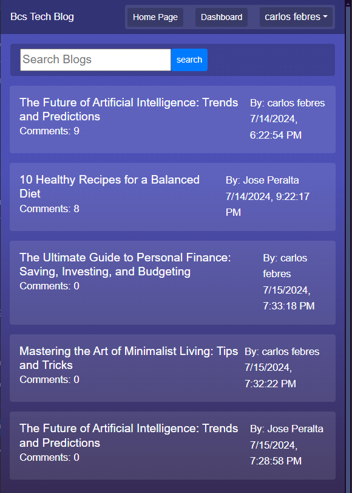

# Bcs-Tech-Blog

 

## Description

This project is a web-based blog platform that allows users to create, read, update, and delete blog posts. Users can also search for blog posts.  
The platform features user authentication so that only registered users can create and manage their own blog posts.  

 

  

https://bcs-tech-blog.onrender.com/

 

## Table of Content
- [Features](#features)
- [Technologies Used](#technologies-used)
- [Author](#author)
- [Contribution](#contribution)
- [Questions](#questions)
- [License](#license)

 

## Features

- **User Authentication**: Secure login and signup functionality.
- **Create Blog Posts**: Registered users can create new blog posts.
- **Update and Delete Blog Posts**: Users can edit or delete their own blog posts.
- **Search Functionality**: Users can search for blog posts by title and content.
- **Comments**: Users can comment on blog posts.
- **Responsive Design**: The platform is optimized for both desktop and mobile devices.

 

## Technologies Used

- **Frontend**: HTML, CSS, JavaScript, jQuery, Bootstrap
- **Backend**: Node.js, Express.js
- **Database**: Sequelize (with PostgreSQL)
- **Authentication**: bcrypt
- **Others**: jQuery, AJAX

 

## Author
Carlos Febres

 

## Contribution
Contributions are welcome  
Please get in contant for details on our code of conduct, and the process for submitting pull requests to us.

 

## Questions
For questions please get in contant.
Github Profile: https://github.com/Example123
Email: Example123@gmail.com

 

## License

This project is licensed under the MIT License - see the [LICENSE](https://opensource.org/licenses/MIT) for details.

